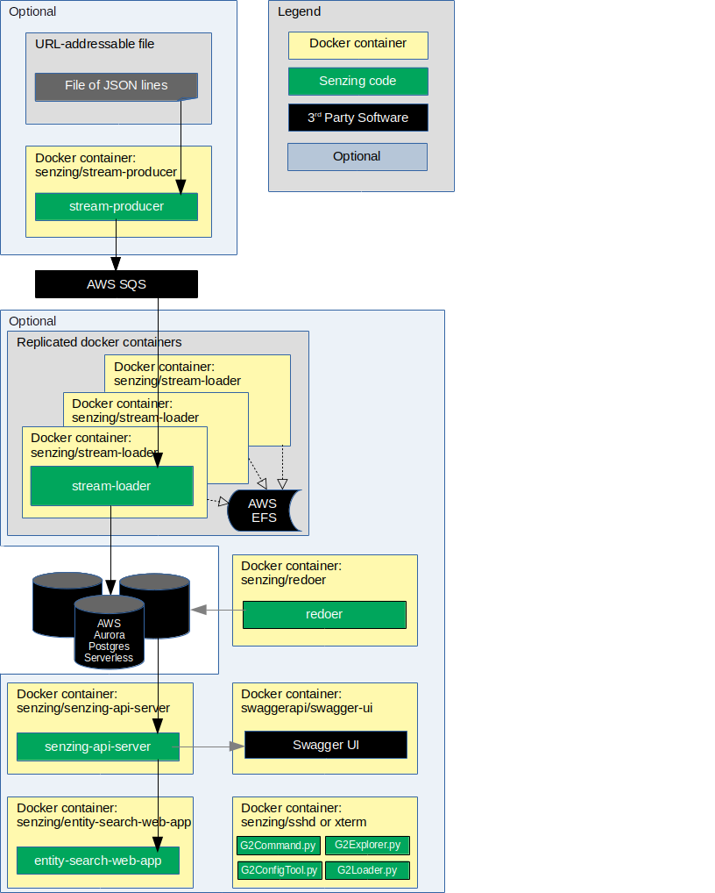

# Cloudformation: senzing-demo-full-stack

## Synopsis

The `senzing-demo-full-stack` demonstrates a Senzing deployment using an AWS Cloudformation template.

## Overview

The `senzing-demo-full-stack` demonstration is an AWS Cloudformation template that creates the following resources:

1. AWS infrastructure
    1. VPC
    1. Subnets
    1. Internet Gateway
    1. Routes
    1. IAM Roles and Policies
    1. Logging
1. AWS services
    1. AWS Elastic File System (EFS)
    1. AWS Simple Queue Service (SQS)
    1. AWS Relational Data Service (RDS) Aurora Postgres Serverless
    1. AWS Elastic Container Service (ECS) Fargate
1. Senzing services
    1. Senzing Stream-Loader
    1. Senzing Redoer
    1. Senzing API server
    1. Senzing Entity Search Web App
1. Optional services:
    1. SwaggerUI
    1. Senzing Stream-producer
    1. Senzing SSH access
    1. AWS VPC Flow Logs

The following diagram shows the relationship of the docker containers in this docker composition.
Arrows represent data flow.



This docker formation brings up the following docker containers:

1. *[senzing/entity-web-search-app](https://github.com/Senzing/entity-search-web-app)*
1. *[senzing/redoer](https://github.com/Senzing/redoer)*
1. *[senzing/senzing-api-server](https://github.com/Senzing/senzing-api-server)*
1. *[senzing/sshd](https://github.com/Senzing/docker-sshd)*
1. *[senzing/stream-loader](https://github.com/Senzing/stream-loader)*
1. *[senzing/stream-producer](https://github.com/Senzing/stream-producer)*

Help for
[senzing-demo-full-stack](https://github.com/Senzing/aws-cloudformation-ecs/tree/main/cloudformation/senzing-demo-full-stack).

### Contents

1. [Preamble](#preamble)
    1. [Legend](#legend)
1. [Expectations](#expectations)
1. [Demonstrate using AWS Console](#demonstrate-using-aws-console)
1. [Parameters](#parameters)
1. [Outputs](#outputs)

## Preamble

At [Senzing](http://senzing.com),
we strive to create GitHub documentation in a
"[don't make me think](https://github.com/Senzing/knowledge-base/blob/master/WHATIS/dont-make-me-think.md)" style.
For the most part, instructions are copy and paste.
Whenever thinking is needed, it's marked with a "thinking" icon :thinking:.
Whenever customization is needed, it's marked with a "pencil" icon :pencil2:.
If the instructions are not clear, please let us know by opening a new
[Documentation issue](https://github.com/Senzing/aws-cloudformation-ecs/issues/new?template=documentation_request.md)
describing where we can improve.   Now on with the show...

### Legend

1. :thinking: - A "thinker" icon means that a little extra thinking may be required.
   Perhaps there are some choices to be made.
   Perhaps it's an optional step.
1. :pencil2: - A "pencil" icon means that the instructions may need modification before performing.
1. :warning: - A "warning" icon means that something tricky is happening, so pay attention.

## Expectations

- **Space:** This repository and demonstration require 6 GB free disk space.
- **Time:** Budget 40 minutes to get the demonstration up-and-running.
- **Background knowledge:** This repository assumes a working knowledge of:
  - [AWS Cloudformation](https://github.com/Senzing/knowledge-base/blob/master/WHATIS/aws-cloudformation.md)

## Demonstrate using AWS Console

### Launch AWS Cloudformation

1. Visit [AWS Cloudformation with Senzing template](https://console.aws.amazon.com/cloudformation/home#/stacks/new?templateURL=https://public-read-access.s3.amazonaws.com/aws-cloudformation-ecs-full-stack/cloudformation.yaml).
1. In lower-right, click on "Next" button.
1. In **Specify stack details**
    1. In **Stack name**
        1. Enter an identifier of your choosing.
           Example: "senzing-demo"
    1. In **Parameters**
        1. In **Acknowledge insecure system**
            1. Understand the nature of the security in the deployment.
            1. Once understood, enter "I AGREE".
        1. In **Senzing installation**
            1. Accept the End User Licence Agreement
        1. In **Security**
            1. Enter your email address.
    1. Other parameters are optional.
    1. In lower-right, click "Next" button.
1. In **Configure stack options**
    1. In lower-right, click "Next" button.
1. In **Review {stack-name}**
    1. Near the bottom, in **Capabilities**
        1. Check ":ballot_box_with_check: I acknowledge that AWS CloudFormation might create IAM resources."
    1. In lower-right, click "Create stack" button.
1. Senzing formation takes about 15 minutes to fully deploy.

### View results

1. Visit [AWS Cloudformation console](https://console.aws.amazon.com/cloudformation/home).
1. Choose appropriate "Stack name"
1. Choose "Outputs" tab.
    1. For descriptions of outputs, click on the value for `ADescriptionOfOutputs`,
       which links to [Outputs](#outputs) further down this page.

## Parameters

Technical information on AWS Cloudformation parameters can be seen at
[Parameters](https://docs.aws.amazon.com/AWSCloudFormation/latest/UserGuide/parameters-section-structure.html).

### AcceptEula

1. **Synopsis:**
   To use the Senzing code, you must agree to the End User License Agreement (EULA).
   This step is intentionally tricky to ensure that you make a conscious effort to accept the EULA.
1. **Required:** Yes
1. **Type:** String
1. **Allowed values:** See [SENZING_ACCEPT_EULA](https://github.com/Senzing/knowledge-base/blob/master/lists/environment-variables.md#senzing_accept_eula).
1. **Default:** None

### AcknowledgeInsecureSystem

1. **Synopsis:**
   Acknowledgement of the security level of the system.
1. **Required:** Yes
1. **Type:** String
1. **Allowed values:** "I AGREE"
1. **Default:** None

### CidrInbound

1. **Synopsis:** The password used to access the AWS Aurora Postgres Serverless databases.
1. **Required:** Yes
1. **Type:** String
1. **Allowed pattern:** Letters and numbers. Specifically: `'(?:\d{1,3}\.){3}\d{1,3}(?:/\d\d?)?'`
1. **Allowed values:** String in IPv4 [CIDR format](https://en.wikipedia.org/wiki/Classless_Inter-Domain_Routing).
1. **Example:** 45.26.129.200/32
1. **Default:** 0.0.0.0/0

### CognitoAdminEmail

1. **Synopsis:** An email address that will be used as a username to access the system via AWS Cognito.
1. **Required:** Yes
1. **Type:** String
1. **Allowed pattern:** A valid email address
1. **Example:** me@example.com
1. **Default:** None

### RunApiServer

1. **Synopsis:**
   Optionally, run the
   [Senzing API server](https://github.com/Senzing/senzing-api-server)
   to create a RESTful API service to the Senzing Engine.
1. **Required:** Yes
1. **Type:** Boolean
1. **Allowed values:**
   [ "Yes" | "No" ]
1. **Default:** Yes

### RunJupyter

1. **Synopsis:**
   Optionally, run the
   [Senzing Jupyter notebooks](https://github.com/Senzing/docker-jupyter)
   to view Jupyter notebooks showing Senzing code samples.
1. **Required:** Yes
1. **Type:** Boolean
1. **Allowed values:**
   [ "Yes" | "No" ]
1. **Default:** No

### RunRedoer

1. **Synopsis:**
   Optionally, run the
   [redoer](https://github.com/Senzing/redoer)
   to process "redo records"
1. **Required:** Yes
1. **Type:** Boolean
1. **Allowed values:**
   [ "Yes" | "No" ]
1. **Default:** Yes

### RunSshd

1. **Synopsis:**
   Optionally, run the
   [sshd](https://github.com/Senzing/docker-sshd)
   container that allows `ssh` and `scp` access.
   Can be used for debugging, copying files to the EFS, or the Senzing Exploratory Tools.
1. **Required:** Yes
1. **Type:** Boolean
1. **Allowed values:**
   [ "Yes" | "No" ]
1. **Default:** Yes

### RunStreamLoader

1. **Synopsis:**
   Optionally, run the
   [stream-loader](https://github.com/Senzing/stream-loader)'
   which reads records from the SQS queue and sends them to the Senzing Engine.
1. **Required:** Yes
1. **Type:** Boolean
1. **Allowed values:**
   [ "Yes" | "No" ]
1. **Default:** Yes

### RunStreamProducer

1. **Synopsis:**
   Optionally, run the
   [stream-producer](https://github.com/Senzing/stream-producer)
   container that fetches JSON lines from a file and pushes them to the SQS queue.
   If "Yes" is chosen,
   [SenzingInputUrl](#senzinginputurl),
   [SenzingRecordMin](#senzingrecordmin),
   and
   [SenzingRecordMax](#senzingrecordmax)
   need to be specified.
1. **Required:** Yes
1. **Type:** Boolean
1. **Allowed values:**
   [ "Yes" | "No" ]
1. **Default:** Yes

### RunSwagger

1. **Synopsis:**
   Optionally, run the
   [swaggerapi/swagger-ui](https://github.com/swagger-api/swagger-ui)
   container that hosts the SwaggerUI for viewing the
   [Senzing REST API OpenAPI document](https://github.com/Senzing/senzing-rest-api-specification).
1. **Required:** Yes
1. **Type:** Boolean
1. **Allowed values:**
   [ "Yes" | "No" ]
1. **Default:** Yes

### RunVpcFlowLogs

1. **Synopsis:**
   Optionally, capture information about the IP traffic going to and from network interfaces in your VPC.
1. **Required:** Yes
1. **Type:** Boolean
1. **Allowed values:**
   [ "Yes" | "No" ]
1. **Default:** No
1. **References:**
    1. [VPC Flow Logs](https://docs.aws.amazon.com/vpc/latest/userguide/flow-logs.html).

### RunWebApp

1. **Synopsis:**
   Optionally, run the
   [entity-search-web-app](https://github.com/Senzing/entity-search-web-app)
   which gives a web-based representation of data stored in the Senzing data model.
1. **Required:** Yes
1. **Type:** Boolean
1. **Allowed values:**
   [ "Yes" | "No" ]
1. **Example:**
1. **Default:** Yes

### RunXterm

1. **Synopsis:**
   Optionally, run the
   [Senzing Xterm](https://github.com/Senzing/docker-xterm)
   which gives a web-base terminal useful in running command line programs.
1. **Required:** Yes
1. **Type:** Boolean
1. **Allowed values:**
   [ "Yes" | "No" ]
1. **Example:**
1. **Default:** Yes

### SenzingInputUrl

1. **Synopsis:**
   If using [RunStreamProducer](#runstreamproducer), supply the URL of a tar-gzipped file in JSON-lines format containing records to ingest into Senzing.
1. **Required:** Yes if running Stream Producer, otherwise no.
1. **Type:** String
1. **Allowed pattern:**  A URL starting with `http://` or `https://`.
1. **Example:** `https://www.example.com/my/records.json.gz`
1. **Default:** `https://public-read-access.s3.amazonaws.com/TestDataSets/test-dataset-100m.json.gz`

### SenzingLicenseAsBase64

1. **Synopsis:**
   To ingest more than 100,000 records, a Senzing license is required.
   A binary version of the Senzing license, `g2.lic`, is not usable as a parameter in the text entry field.
   Instead, a [Base64](https://en.wikipedia.org/wiki/Base64) representation of the information is needed.
   An example of how to produce base64 from `g2.lic` on Linux and macOS:

   ```console
   base64 /opt/senzing/etc/g2.lic
   ```

   Copy the entire output from the command and paste into the text entry field.
1. **Required:** Yes if ingesting more than 100,000 records, otherwise no.
1. **Type:** String
1. **Allowed pattern:** Empty or Base64 characters. Specifically `^$|[^-A-Za-z0-9+/=]|=[^=]|={3,}$`
1. **Allowed values:** Base64 encoded string
1. **Example:**

   ```console
   AQAAADgCAAAAAAAAU2VuemluZwAAAAAAAAAAAAAAAAAAAAAAAAAAAAAAAAAAAAAAAAAAAAAAAAAA
   AAAAAAAAAAAAAAAAAAAAAAAAAAAAAAAAAAAAAAAAAAAAAAAAAAAAAAAAAAAAAAAAAAAAAAAAAAAA
   AAAAAAAAAAAAAAAAAAAAAAAAAAAAAAAAAAAAAAAAAAAAAAAAAAAAAAAAAAAAAAAAAAAAAAAAAAAA
   AAAAAAAAAAAAAAAAAAAAAAAAAAAAAAAAAAAAAAAAAAAAAAAAAAAAAAAAAAAAAAAAAAAAAAAAAAAA
   AAAAAAAAAAAAAAAAAAAAAAAAAAAAAAAAAAAAAAAAAAAAAAAAAAAARGVtbyBFeHBpcmVkAAAAAAAA
   AAAAAAAAAAAAAAAAAAAAAAAAAAAAAAAAAAAAAAAAAAAAAAAAAAAAAAAAAAAAADIwMjAtMTItMTYA
   AAAAAAAAAAAARVZBTAAAAAAAAAAAAAAAAAAAAAAAAAAAAAAAAAAAAAAAAAAAAAAAAAAAAAAAAAAA
   AAAAAAAAAAAAAAAAAAAAAFNUQU5EQVJEAAAAAAAAAAAAAAAAAAAAAAAAAAAAAAAAAAAAAAAAAAAA
   AAAAAAAAAAAAAAAAAAAAAAAAAAAAAAAAAAAAAKCGAQAAAAAAMTk3Ni0wMS0wMQAAAAAAAAAAAABN
   T05USExZAAAAAAAAAAAAAAAAAAAAAAAAAAAAAAAAAAAAAAAAAAAAAAAAAAAAAAAAAAAAAAAAAAAA
   AAAAAAAARkdIST5XYOZ90kbyAbU7wM7XvPCwq/FgORZIekwFMg8zi3tCD0V5+12q72aqk0E6JOct
   +cPAq/T50N5Pf5nvJZ6TaW3TzQbnH/z5f/ALsWLydE2DPNvq3HuAjkjZpg2h7mb4OUqorGxDI9RX
   TX8hPjzYrBfMdOgl1DlRBVG36WwdpB8AnSfaegbYU+U/vfof+ff6mJk8gzPg+OGPwg21/S6i2TT4
   RbTCSYP/TpfXyJGE6dbQWEC9rFhYuWq3mFF3z7zFEcmxpNfZuBtYsxni8P3sDZ706RA+wcQF7TVg
   giJoK03W8kd6mk3X+fvc4ARJo9RarYInsAvSHKlr1KpxeebuirfqgSz+uEW6pqOD1fV0oHnFncdf
   jV2k2CqmIfThB/ONQcn/4/EIlhdzXqxSlXAGz6C7ApHq6xUCdLILx/NfdUEypHIfyabrpXKOKOPx
   zekhGztEzB0gSJNebEa++EKxHDOc1Sc0YD9q9KvcaGSPTjlCJeaNhufg9Sz/iXZMP+d4Vkp+Bn6p
   mfUPG7tKharEoRChUNfRms8wVyNxmz6LRw5Uy14Dlodd0LyBQRB9Tx8FVYMh5AElwjbQOoDOIRvi
   IQIGsUNp/ZkP7PdBxc/b9o3rjUsZCzyCtP+jflZSqMenzXCsTI1Xay6On2wSVwQdJ1/2eIwKEfCF
   hj4DZlY5+jSo
   ```

1. **Default:** None

### SenzingRecordMax

1. **Synopsis:**
   When using [SenzingInputUrl](#senzinginputurl), this indicates the number of the last line that will be
   read from the file.
   It is used to limit the number of records ingested into Senzing.
1. **Required:** Yes if using [SenzingInputUrl](#senzinginputurl), otherwise no.
1. **Type:** Number
1. **Allowed pattern:** Numbers. Specifically: `[0-9]*`
1. **Allowed values:** 0 = Read entire file;  Any positive integer.
1. **Example:** 15000000
1. **Default:** 0

### SenzingRecordMin

1. **Synopsis:**
   When using [SenzingInputUrl](#senzinginputurl), this indicates the number of the first line that will be
   read from the file.
   Used to skip lines at the beginning of the file.
   It is handy if the beginning of the file has already been ingested into Senzing.
1. **Required:** Yes if using [SenzingInputUrl](#senzinginputurl), otherwise no.
1. **Type:** Number
1. **Allowed pattern:** Numbers. Specifically: `[0-9]*`
1. **Allowed values:** 0 = Read from beginning;  Any positive integer.
1. **Example:** 100000
1. **Default:** 0

### VpcAvailabilityZones

1. **Synopsis:**
   When using [VpcId](#vpcid), list VPC availability zones in which to create subnets.
   Two availability zones need to be specified.
   Anything after two will be ignored.
1. **Required:** Yes if using [VpcId](#vpcid), otherwise no.
1. **Type:** CommaDelimitedList
1. **Allowed pattern:** Comma-delimited list of VPC availability zones in which to create subnets.
1. **Example:** us-east-1a,us-east-1e
1. **Default:** None - default availability zones used based on
   [Fn::GetAZs](https://docs.aws.amazon.com/AWSCloudFormation/latest/UserGuide/intrinsic-function-reference-getavailabilityzones.html) and
   [AWS::Region](https://docs.aws.amazon.com/AWSCloudFormation/latest/UserGuide/pseudo-parameter-reference.html#cfn-pseudo-param-region)
1. **References:**
    1. [Regions and Zones](https://docs.aws.amazon.com/AWSEC2/latest/UserGuide/using-regions-availability-zones.html)

### VpcId

1. **Synopsis:**
   VPC Id of existing VPC.
   If not specified, a new VPC will be created.
1. **Required:** No
1. **Type:** String
1. **Allowed pattern:** `vpc-` followed by unique id. Specifically `^(?:vpc-[0-9a-f]{8}|vpc-[0-9a-f]{17}|)$`
1. **Example:** vpc-1a2b3c4d5e6f7g8h9
1. **Default:** None - a new VPC will be created

## Outputs

### AccountID

1. **Synopsis:**
   AWS account from which Cloudformation was deployed.

### CertificateArn

1. **Synopsis:**
   Amazon Resource Name (ARN) of certificate used for SSL support.
   More information at
   [AWS LoadBalancer Console](https://console.aws.amazon.com/ec2/v2/home#LoadBalancers).
   Select a load balancer, view the "Listeners" tab, then click "View/edit certificates".

### DatabaseHostCore

1. **Synopsis:**
   One of three Senzing databases.
   More information at
   [AWS RDS Console](https://console.aws.amazon.com/rds/home).

### DatabaseHostLibfeat

1. **Synopsis:**
   Two of three Senzing databases.
   More information at
   [AWS RDS Console](https://console.aws.amazon.com/rds/home).

### DatabaseHostRes

1. **Synopsis:**
   Three of three Senzing databases.
   More information at
   [AWS RDS Console](https://console.aws.amazon.com/rds/home).

### DatabaseName

1. **Synopsis:**
   Name of database in each of the three databases.
   More information at
   [AWS RDS Console](https://console.aws.amazon.com/rds/home).

### DatabasePassword

1. **Synopsis:**
   Password to access database in each of the three databases.
   More information at
   [AWS RDS Console](https://console.aws.amazon.com/rds/home).

### DatabasePortCore

1. **Synopsis:**
   The port used to access the [DatabaseHostCore](#databasehostcore) database.
   More information at
   [AWS RDS Console](https://console.aws.amazon.com/rds/home).

### DatabasePortLibfeat

1. **Synopsis:**
   The port used to access the [DatabaseHostLibfeat](#databasehostlibfeat) database.
   More information at
   [AWS RDS Console](https://console.aws.amazon.com/rds/home).

### DatabasePortRes

1. **Synopsis:**
   The port used to access the [DatabaseHostRes](#databasehostres) database.
   More information at
   [AWS RDS Console](https://console.aws.amazon.com/rds/home).

### DatabaseUsername

1. **Synopsis:**
   Username to access database in each of the three databases.
   More information at
   [AWS RDS Console](https://console.aws.amazon.com/rds/home).

### Ec2Vpc

1. **Synopsis:**
   Identifier of the Virtual Private Cloud (VPC).
   More information at
   [AWS VPC Console](https://console.aws.amazon.com/vpc/home#vpcs:).

### Host

   More information at
   [AWS Load Balancers Console](https://console.aws.amazon.com/ec2/v2/home?region=us-east-1#LoadBalancers).
   Select a load balancer, view the "Description" tab, view **DNS name**.

### Queue

1. **Synopsis:**
   The queue from which records are ingested into Senzing Engine.
   In otherwords, this is the queue where records are sent to be inserted into the Senzing Engine.
   More information at [AWS SQS Console](https://console.aws.amazon.com/sqs/v2/home?#/queues).

### QueueDeadLetter

1. **Synopsis:**
   The queue to which records that are not able to be ingested into Senzing Engine are sent.
   In otherwords, if the JSON message is malformed, or Senzing d into the Senzing Engine.
   More information at [AWS SQS Console](https://console.aws.amazon.com/sqs/v2/home?#/queues).

### QueueInfo

1. **Synopsis:**
   The queue to which "WithInfo" results are sent by the
   [stream-loader](https://github.com/Senzing/stream-loader)
   after ingesting records from the [Queue](#queue).
   More information at [AWS SQS Console](https://console.aws.amazon.com/sqs/v2/home?#/queues).

### SenzingVersion

1. **Synopsis:**
   The version of Senzing installed onto the AWS Elastic File System.
   More information at [Senzing API Version History](https://senzing.com/releases/#api-releases).

### SshPassword

1. **Synopsis:**
   Password to be used when logging into the
   [SSHD container](#runsshd).

### SshUsername

1. **Synopsis:**
   User ID to be used when logging into the
   [SSHD container](#runsshd).

### SubnetPrivate1

### SubnetPrivate2

### SubnetPublic1

### SubnetPublic2

### UrlApiServer

1. **Synopsis:**
   A URL showing how to reach the
   [Senzing API Server](https://github.com/Senzing/senzing-api-server).

### UrlApiServerHeartbeat

1. **Synopsis:**
   A URL showing how to reach the
   [Senzing API Server](https://github.com/Senzing/senzing-api-server)
   directly.
   The `/heartbeat` URI path simply demonstrates that the API server is responding.
   For more URIs, see
   [SwaggerUrl output value](#urlswagger).

### UrlJupyter

1. **Synopsis:**
   A URL showing how to reach the
   [Senzing Jupyter notebooks](https://github.com/Senzing/docker-jupyter).

### UrlSwagger

1. **Synopsis:**
   A URL showing how to reach the
   [swaggerapi/swagger-ui](https://github.com/swagger-api/swagger-ui)
   for viewing the
   [Senzing REST API OpenAPI document](https://github.com/Senzing/senzing-rest-api-specification).

### UrlWebApp

1. **Synopsis:**
   A URL showing how to reach the
   [Senzing Entity Search Web App](https://github.com/Senzing/entity-search-web-app).

### UrlXterm

1. **Synopsis:**
   A URL showing how to reach the
   [Senzing Xterm](https://github.com/Senzing/docker-xterm).

### WebInitPassword

1. **Synopsis:**
   A one-time password for logging into AWS Cognito.
   More information at
   [AWS User Pools](https://console.aws.amazon.com/cognito/users/).
   Select User Pool, select Users and Groups.

### WebUsername

1. **Synopsis:**
   The initial AWS Cognito user defined by the CloudFormation deployment.
   Additional users can be created by viewing
   more information at
   [AWS User Pools](https://console.aws.amazon.com/cognito/users/).
   Select User Pool, select "Users and Groups", select "Create user"
